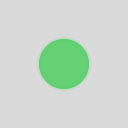

# 灯体收缩浅白环诊断记录

关联规格：`docs/plan/2026-10-06-light-halo-white-ring.md`。

## 结论与实施边界

当前生产提交 `ed76e7f` 的固定帧和连续离屏测试没有复现用户截图中的浅白环。第一阶段诊断完成；第二阶段缺少足以选择绘制修正的证据，第三阶段尚未执行。生产灯效未修改，发布包未重建，不宣称白圈已经解决。

真实窗口采样缺少屏幕录制权限而跳过；本轮没有权限修改系统授权，也不能用强制重绘、移动或重建窗口代替复现。因此，当前属于“静态与连续离屏未复现，实际屏幕未覆盖”，不是“已证明 WindowServer 有问题”。

## 可重复命令

```sh
swift test --filter 'HUDLightRenderingTests|HUDLightAnimationTests|HUDLightDiagnosticTests'
```

实际退出码零。共14项：13项通过、1项因缺少录屏权限跳过、0项失败。`git diff --check` 通过。编译及测试使用已授权的沙箱外 Swift 缓存。

全部生成产物在 `/private/tmp/traceflow-light-halo-white-ring/`，重复命令可重新生成，不依赖临时图作为永久证据。最少代表图及校准数据已复制到本文旁边的仓库目录。

## 校准与静态矩阵

故障控制是同色灯体与外环之间人为留出的透明间隔；正常控制是单圆及连续向外淡出的同色渐变。测试使用实际SwiftUI绘制，不以生产R/W公式生成预期图。

- 透明RGBA读取统一转换为sRGB预乘格式，合成背景使用 `P + (1-alpha) × B`。
- 八方向逐像素采样，重复最近邻像素不重复计数。径向指标查找至少两个独立采样点的低对比带，之后外侧再次出现明显灯色；不把自然淡出算成间隙。
- 阈值由正常控制的最大回升噪声加3个RGBA8量化步长得出，范围约0.0117647～0.0121261。阈值在生产检查前校准，未根据生产结果放宽。
- 人为故障样本回升指标约0.246697～0.701961，在所有三色、倍率及背景均检出；正常控制通过。原始校准数据：[calibration.csv](light-halo-white-ring/calibration.csv)。

生产矩阵：三色×两模式×八进度×两倍率×四背景，共384组合。q为0、0.02、0.05、0.1、0.25、0.5、0.75、1；背景为透明、白、0.85浅灰及0.2深灰。所有组合的分隔带回升指标为零，未检出静态分隔带，没有“首个异常q”。低进度外晕小于一个像素时不强求完整有色外圈；本结论仅覆盖上述指标及渲染环境，不等同于人眼全部观感或真实毛玻璃合成。

浅灰底绿灯q=0.25、倍率2代表图：

| 标准 | 强烈 |
| --- | --- |
|  |  |

代表径向对比度曲线：[radial-profile.svg](light-halo-white-ring/radial-profile.svg)。完整矩阵、八方向RGBA采样分别为临时产物 `matrix.csv`、`rays.csv`。

## 连续更新的实际覆盖

三色×两模式×两倍率；每组复用相同展示对象与ImageRenderer，按上升/下降序列重复两轮，合计288帧。序列为0、0.25、0.5、0.75、1、0.75、0.5、0.25、0.1、0.05、0.02、0。每帧等待主循环再采样，与对应新鲜静态帧比较，全部像素与外轮廓区域的平均差异均为零。

测试也持有同一NSHostingView并确认其展示对象不更换，但没有对该承载强制绘制后截图；以上像素来自ImageRenderer，而非NSHostingView缓存或WindowServer。这只能证明该离屏渲染路径无下降残留。明示“未采样承载/实屏”以防编码模型把离屏通过当成真实窗口正常。

真实窗口测试使用同一64×64透明面板、同一承载、固定位置与窗口编号，在受控白背景上逐帧更新三色两模式，准备记录截图和时间；`CGPreflightScreenCaptureAccess` 返回无权限，测试在窗口创建前跳过，没有画面结果。生产TimelineView及毛玻璃背景的完整真实周期仍待实屏采样。

## 未选择候选及下一步

没有异常静态像素证据，因此未修改透明渐变端点、遮罩或衔接宽度；没有连续离屏残留，因此未改为Canvas。未经验证不能选择任意候选并以构建通过标记修复。

继续调查需要真实窗口证据：白圈出现时，保持同屏、同位置，记录从变亮到收缩的过程，观察白圈是否停留在上一帧较大半径处；尤其确认切布局后是否仅暂时消失并在下一轮呼吸重新出现。可在获得录屏权限的测试进程中运行本诊断，再补充生产毛玻璃实际周期采样。系统授权须由用户完成，不能自行绕过。

如果实屏仅在毛玻璃窗口复现，后续调查要比较同一灯效在普通受控底与生产背景上的连续结果；在获得证据前，不改标题生命周期、不每帧换窗口，不叠加强制刷新。

## 第一阶段提交后的用户反馈

诊断提交 `2cc7d57` 后，用户明确反馈：切一次HUD布局后，后续呼吸不再出现白圈。绿灯达到最小半径时最容易出现，红黄灯较少出现；此外观察到三灯在用户所称的最小半径状态存在灰／黑圈。截图为布局切换后的结果，不是可测量完整下降轨迹的原生帧序列，不能从这一张图直接计算原白圈宽度或滞后半径。

只读检查确认当前运行路径为 `/Applications/Traceflow.app/Contents/MacOS/Traceflow`；安装版与发布包主程序SHA-256均为 `6512f4e4397d721f50903b24f8334782aad463647b15ab57ba8c7d531eca5f5f`。可排除这一次“安装包与待测包不一致”，不能据此证明具体绘制机制。

现在证据更倾向“仅实际窗口的初始或连续更新状态有关”，而非固定半径或静态颜色公式。下一诊断重点是布局切换前后，同一绿灯的两个完整周期，特别是最低半径及上一帧较大半径附近的像素；同时分别检查未点亮圆和点亮最低帧，判断灰黑边线是否也随整窗替换消失。

当前代码没有白色、灰色或黑色描边。未点亮灯并非呼吸最低帧：半径13、alpha0.18；当前点亮灯呼吸最低帧为半径11.7、alpha0.55。图中正常半透明灯体、抗锯齿边缘和真正外沿残留必须分别判定，不以“三灯都最小”的描述自动取消未点亮灯颜色。

用户反馈可支持继续评估PRD的单一Canvas完整绘制候选，但尚缺前后连续实屏采样，不能把候选写成已经有效，也不能扩大到删除所有灰边或改变灯体透明度。灰／黑圈是否在切布局后仍存在已向用户确认，回答尚待补充。

### 灰黑边缘追加证据

用户确认布局切换后灰／黑边圈仍然存在。对白圈恢复后的截图（410×59像素）使用Python标准库只读解析PNG，按估计圆心(42,28)、(74,28)、(106,28)采样右侧及下侧，均发现窄暗带：

| 灯 | 右侧采样点距离（截图像素） | 边缘RGB | 附近外背景RGB |
| --- | --- | --- | --- |
| 红 | 13 | (147,144,147) | (166,163,165) |
| 黄 | 13 | (146,143,143) | (164,161,163) |
| 绿 | 12 | (106,104,105) | (162,158,160) |

垂直方向也出现相近暗值，支持这不是单一异常像素。此处未将截图缩放、估计圆心或位置转换成生产半径，也不能用上述字节证明某个SwiftUI修饰器是根因。截图没有覆盖白圈发生前后的完整动画，因此只能记录暗带的当前画面事实。

第一阶段的“低对比带后向外回升”检测未覆盖“窄环更暗且偏中性”的异常。384组检测为零不能用于排除灰黑圈。下一诊断应校准同色单圆、单调渐变以及测试专用中性暗环，并检查透明帧边缘是否有不属于当前灯色的预乘RGB；再比较直接渲染浅灰底与透明帧手动合成，区分透明颜色插值和实际背景合成。白圈与暗边不可用同一检测器结论互相代替。
