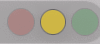

# 灯体收缩浅白环诊断记录

关联规格：`docs/plan/2026-10-06-light-halo-white-ring.md`。

## 最终验收：用户确认效果符合预期

用户测试后明确反馈：“测试发现显示正常，是想要的效果”。据此记录本轮用户实测场景的异色边圈修复验收通过，保留关闭系统窗口阴影这一唯一生产变更，关闭本轮修复。

验收依据为用户实测反馈。本次附件提示本地GIF无法读取，未将此前GIF或其缓存帧当作新的修复后图像，也未宣称独立逐帧验证完成。用户未逐项提供模式、背景、透明度和周期数据，因此不将该反馈扩写成全矩阵实屏采样通过。此前六项自动屏幕测试的录屏权限跳过状态保持不变。

该反馈支持窗口阴影修改在用户实测环境中有效。无需修改灯体半径、透明度或光晕，不再叠加Canvas及刷新补丁。

## 本轮第三阶段：交付与自动验证记录

以下为交付时记录，当时实屏项目待验收；后续验收结论见顶部。

第二阶段提交 `8c50bd8` 后立即继续全量验证及发布构建，未追加其他生产候选。构建源代码对应该提交，后续提交只更新验证文档。

| 验证命令 | 退出码 | 结果 |
| --- | --- | --- |
| `swift test` | 0 | 240项：234通过、6跳过、0失败 |
| `sh scripts/build-app.sh` | 0 | release构建、Info.plist检查及本地签名完成 |
| `codesign --verify --deep --strict dist/Traceflow.app` | 0 | 签名校验通过 |
| `env LC_ALL=C shasum -a 256 dist/Traceflow.app/Contents/MacOS/Traceflow` | 0 | 实际哈希见下方 |
| `git diff --check` | 0 | 通过 |

发布包：`dist/Traceflow.app`。主程序SHA-256：

```text
602c02ca3213194ad5ea3c584f0b4fa4b9e6704a1e00ad86c4217c12ea495851
```

全量日志：`/private/tmp/traceflow-shadow-full.log`；发布构建日志：`/private/tmp/traceflow-shadow-build-app.log`。打包首次沙箱执行退出码1，原因同样是Swift缓存不可访问；授权后重跑成功，未修改打包脚本。

六个跳过项全部因缺少屏幕录制权限：布局切换合成、跨屏返回、灯体持续收缩、默认名称与首标题交接、标题动画方向、标题与布局中断边界。没有将跳过计为通过，也没有修改系统权限。

| 实屏项目 | 当前结果 |
| --- | --- |
| 白圈：两种模式、三色、收缩最低帧及首次显示 | 待验收 |
| 灰黑圈：点亮及未点亮灯体 | 待验收 |
| 四布局及跨方向切换残影 | 自动回归通过，实屏回归待验收 |
| 默认名称与首会话标题重叠 | 自动回归通过，实屏回归待验收 |
| 浅深背景、透明度10与86、减少动态效果 | 待验收 |

已批准的代码和候选包交付阶段完成，整个视觉修复尚未验收。系统窗口外部投影随本候选取消；不恢复新投影、不引入Canvas，不据自动测试断言阴影已经被证明为根因。

用户当前安装版哈希仍为 `6512f4e4397d721f50903b24f8334782aad463647b15ab57ba8c7d531eca5f5f`，与保留基线一致；本轮没有自动安装、退出或重启用户应用。建议首次测试先保持布局与位置不变，分别观察标准/强烈及三色两个稳定周期，再进行其余回归。实屏通过、部分改善、完全无效分别按PRD J7处理。

## 本轮第二阶段：已批准的无系统阴影候选

用户批准PRD的J节并授权连续实施。生产修改仅在 `HUDPanel.swift`：创建面板时 `hasShadow = false`，删除透明度观察回调中重新开启阴影及 `invalidateShadow()` 的两行。初始与替换窗口共用同一工厂。灯体颜色、透明度、呼吸、光晕、毛玻璃、布局及标题窗口交接均未修改；不新增其他投影。

回归更新已有两处窗口阴影断言，新增四布局下 `[10,55,86,99,100,86,10]` 透明度序列，确认同一窗口不会重新开启阴影、背景alpha正常更新；默认名称、首会话与恢复默认的窗口分别检查阴影关闭。

- `swift build`：退出码0。
- 定向 `swift test --filter 'HUDLightRenderingTests|HUDLightAnimationTests|HUDLightDiagnosticTests|HUDLayoutControllerTests|HUDPlaceholderHandoffTests|HUDTitleRenderingTests'`：退出码0，51项，45通过、6因缺少屏幕录制权限跳过、0失败。
- `git diff --check`：通过。
- 原生静态384组合无分隔带；连续离屏最大平均差异0。色彩诊断值与修改前相同，符合本轮没有改变灯体绘制的范围。

首次定向测试沙箱执行退出码1，原因为Swift缓存不可访问，未进入有效测试；按授权使用沙箱外缓存重新运行获得上述结果。日志：`/private/tmp/traceflow-shadow-targeted.log`。

已在覆盖dist前保留旧包至 `/private/tmp/traceflow-halo-shadow-baseline/Traceflow.app`。旧包与用户当前安装版主程序哈希相同：`6512f4e4397d721f50903b24f8334782aad463647b15ab57ba8c7d531eca5f5f`。未自动安装或更改正在运行的应用。

第二阶段代码与自动回归完成，不等于阴影候选已被实屏证明有效。后续全量测试和候选交付见顶部第三阶段记录；白圈、灰黑圈及完整视觉回归仍待验收。

## 实施前诊断：用户录屏与窗口阴影遗漏

本节为实施前的录屏诊断记录，不将新假设记录为已验证根因。当时生产代码尚未修改；最新生产状态见顶部实施记录。

已读取工作区 `ggg5.gif`：377×55像素、114帧、约16.98秒。使用FFmpeg解码完整合成帧，未把GIF局部更新矩形当成原始截图。逐帧PNG、完整RGB和环带CSV输出至 `/private/tmp/traceflow-gif-frames/`。GIF有颜色量化，以下RGB仅用于说明可辨认暗圈，不作为原生渲染验收阈值。原始附件未纳入Git；只保留不含标题的灯区裁剪。



观察：黄灯也会在收缩时出现明显深色细圈；绿灯及未点亮灯附近存在较弱的暗边。亮起、扩张后的同色光晕会掩盖部分暗边。录屏中有会话状态与标题切换，无法将全部114帧当成同一绿灯的两个完整稳定周期，也未观察到可明确识别的布局切换操作。因此，不据此认定旧轮廓半径保持固定，或证明白圈已消失。

估计黄灯圆心为截图(308,26)。第16帧圆周环带均值：距离约13像素时RGB约(139,135,129)，距离约16像素时约(159,156,158)。前者比邻近背景暗且趋于中性，与单纯向背景透明淡出不同。这是截图像素距离，不是生产逻辑半径；背景不均匀及GIF量化限制精度。

### 代码审查发现

生产 `HUDPanel.swift` 在创建窗口时执行 `panel.hasShadow = transparency < 100`，透明度更新时再次设置并调用 `invalidateShadow()`。透明窗口的系统阴影可能受内部内容alpha轮廓影响，因此灯体也可能参与阴影轮廓；需要实际开关对照才能确认。

此前实际窗口诊断 `HUDLightDiagnosticTests.swift` 明确设置 `panel.hasShadow = false`。离屏ImageRenderer也不包含系统窗口阴影。因此，所有已通过离屏结果，以及尚未执行的无阴影实屏测试，都不能排除生产窗口阴影造成异色边圈。这是验证覆盖遗漏，不是灯效数学公式已经被证实错误。

### 下一修正分支

优先进行单变量对照：同一构建、相同背景、灯色、周期与透明度，仅关闭系统窗口阴影。必须同时覆盖创建窗口及透明度更新两处，否则修改设置后阴影会被重新打开。连续观察标准、强烈模式的点亮最低帧及未点亮帧；不能在每帧调用 `invalidateShadow()`，不能用切布局作为修复。

若开关对照证实有效，选择删除生产系统窗口阴影开关及失效调用，更新已有断言窗口阴影开启的测试；保留所有灯体参数和已验收的窗口交接。若需要保留HUD外部投影，应另行将阴影限制到固定胶囊背景，而不是依赖整个透明窗口的内容轮廓。此项涉及外部投影效果，不在本次自动选择范围。

若关闭阴影后仍有白圈，继续单独调查持久绘制；不把暗圈改善写成两种边圈全部解决，也不同时引入Canvas遮盖诊断结果。

原PRD附录A明确要求 `HUDPanel.swift` 只读。此处阴影开关对照及最终修改需要扩展该边界；本次只提交录屏分析，未越过已批准范围修改生产代码。尚未完成第二、第三阶段，未生成新安装包。

## 结论与实施边界

当前生产提交 `ed76e7f` 的固定帧和连续离屏测试没有复现用户截图中的浅白环。第一阶段诊断完成；第二阶段缺少足以选择绘制修正的证据，第三阶段尚未执行。生产灯效未修改，发布包未重建，不宣称白圈已经解决。

真实窗口采样缺少屏幕录制权限而跳过；本轮没有权限修改系统授权，也不能用强制重绘、移动或重建窗口代替复现。因此，当前属于“静态与连续离屏未复现，实际屏幕未覆盖”，不是“已证明 WindowServer 有问题”。

## 可重复命令

```sh
swift test --filter 'HUDLightRenderingTests|HUDLightAnimationTests|HUDLightDiagnosticTests'
```

实际退出码零。共14项：13项通过、1项因缺少录屏权限跳过、0项失败。`git diff --check` 通过。编译及测试使用已授权的沙箱外 Swift 缓存。

全部生成产物在 `/private/tmp/traceflow-light-halo-white-ring/`，重复命令可重新生成，不依赖临时图作为永久证据。最少代表图及校准数据已复制到本文旁边的仓库目录。

## 校准与静态矩阵

故障控制是同色灯体与外环之间人为留出的透明间隔；正常控制是单圆及连续向外淡出的同色渐变。测试使用实际SwiftUI绘制，不以生产R/W公式生成预期图。

- 透明RGBA读取统一转换为sRGB预乘格式，合成背景使用 `P + (1-alpha) × B`。
- 八方向逐像素采样，重复最近邻像素不重复计数。径向指标查找至少两个独立采样点的低对比带，之后外侧再次出现明显灯色；不把自然淡出算成间隙。
- 阈值由正常控制的最大回升噪声加3个RGBA8量化步长得出，范围约0.0117647～0.0121261。阈值在生产检查前校准，未根据生产结果放宽。
- 人为故障样本回升指标约0.246697～0.701961，在所有三色、倍率及背景均检出；正常控制通过。原始校准数据：[calibration.csv](light-halo-white-ring/calibration.csv)。

生产矩阵：三色×两模式×八进度×两倍率×四背景，共384组合。q为0、0.02、0.05、0.1、0.25、0.5、0.75、1；背景为透明、白、0.85浅灰及0.2深灰。所有组合的分隔带回升指标为零，未检出静态分隔带，没有“首个异常q”。低进度外晕小于一个像素时不强求完整有色外圈；本结论仅覆盖上述指标及渲染环境，不等同于人眼全部观感或真实毛玻璃合成。

浅灰底绿灯q=0.25、倍率2代表图：

| 标准 | 强烈 |
| --- | --- |
|  |  |

代表径向对比度曲线：[radial-profile.svg](light-halo-white-ring/radial-profile.svg)。完整矩阵、八方向RGBA采样分别为临时产物 `matrix.csv`、`rays.csv`。

## 连续更新的实际覆盖

三色×两模式×两倍率；每组复用相同展示对象与ImageRenderer，按上升/下降序列重复两轮，合计288帧。序列为0、0.25、0.5、0.75、1、0.75、0.5、0.25、0.1、0.05、0.02、0。每帧等待主循环再采样，与对应新鲜静态帧比较，全部像素与外轮廓区域的平均差异均为零。

测试也持有同一NSHostingView并确认其展示对象不更换，但没有对该承载强制绘制后截图；以上像素来自ImageRenderer，而非NSHostingView缓存或WindowServer。这只能证明该离屏渲染路径无下降残留。明示“未采样承载/实屏”以防编码模型把离屏通过当成真实窗口正常。

真实窗口测试使用同一64×64透明面板、同一承载、固定位置与窗口编号，在受控白背景上逐帧更新三色两模式，准备记录截图和时间；`CGPreflightScreenCaptureAccess` 返回无权限，测试在窗口创建前跳过，没有画面结果。生产TimelineView及毛玻璃背景的完整真实周期仍待实屏采样。

## 未选择候选及下一步

没有异常静态像素证据，因此未修改透明渐变端点、遮罩或衔接宽度；没有连续离屏残留，因此未改为Canvas。未经验证不能选择任意候选并以构建通过标记修复。

继续调查需要真实窗口证据：白圈出现时，保持同屏、同位置，记录从变亮到收缩的过程，观察白圈是否停留在上一帧较大半径处；尤其确认切布局后是否仅暂时消失并在下一轮呼吸重新出现。可在获得录屏权限的测试进程中运行本诊断，再补充生产毛玻璃实际周期采样。系统授权须由用户完成，不能自行绕过。

如果实屏仅在毛玻璃窗口复现，后续调查要比较同一灯效在普通受控底与生产背景上的连续结果；在获得证据前，不改标题生命周期、不每帧换窗口，不叠加强制刷新。

## 第一阶段提交后的用户反馈

诊断提交 `2cc7d57` 后，用户明确反馈：切一次HUD布局后，后续呼吸不再出现白圈。绿灯达到最小半径时最容易出现，红黄灯较少出现；此外观察到三灯在用户所称的最小半径状态存在灰／黑圈。截图为布局切换后的结果，不是可测量完整下降轨迹的原生帧序列，不能从这一张图直接计算原白圈宽度或滞后半径。

只读检查确认当前运行路径为 `/Applications/Traceflow.app/Contents/MacOS/Traceflow`；安装版与发布包主程序SHA-256均为 `6512f4e4397d721f50903b24f8334782aad463647b15ab57ba8c7d531eca5f5f`。可排除这一次“安装包与待测包不一致”，不能据此证明具体绘制机制。

现在证据更倾向“仅实际窗口的初始或连续更新状态有关”，而非固定半径或静态颜色公式。下一诊断重点是布局切换前后，同一绿灯的两个完整周期，特别是最低半径及上一帧较大半径附近的像素；同时分别检查未点亮圆和点亮最低帧，判断灰黑边线是否也随整窗替换消失。

当前代码没有白色、灰色或黑色描边。未点亮灯并非呼吸最低帧：半径13、alpha0.18；当前点亮灯呼吸最低帧为半径11.7、alpha0.55。图中正常半透明灯体、抗锯齿边缘和真正外沿残留必须分别判定，不以“三灯都最小”的描述自动取消未点亮灯颜色。

用户反馈可支持继续评估PRD的单一Canvas完整绘制候选，但尚缺前后连续实屏采样，不能把候选写成已经有效，也不能扩大到删除所有灰边或改变灯体透明度。灰／黑圈是否在切布局后仍存在已向用户确认，回答尚待补充。

### 灰黑边缘追加证据

用户确认布局切换后灰／黑边圈仍然存在。对白圈恢复后的截图（410×59像素）使用Python标准库只读解析PNG，按估计圆心(42,28)、(74,28)、(106,28)采样右侧及下侧，均发现窄暗带：

| 灯 | 右侧采样点距离（截图像素） | 边缘RGB | 附近外背景RGB |
| --- | --- | --- | --- |
| 红 | 13 | (147,144,147) | (166,163,165) |
| 黄 | 13 | (146,143,143) | (164,161,163) |
| 绿 | 12 | (106,104,105) | (162,158,160) |

垂直方向也出现相近暗值，支持这不是单一异常像素。此处未将截图缩放、估计圆心或位置转换成生产半径，也不能用上述字节证明某个SwiftUI修饰器是根因。截图没有覆盖白圈发生前后的完整动画，因此只能记录暗带的当前画面事实。

第一阶段的“低对比带后向外回升”检测未覆盖“窄环更暗且偏中性”的异常。384组检测为零不能用于排除灰黑圈。下一诊断应校准同色单圆、单调渐变以及测试专用中性暗环，并检查透明帧边缘是否有不属于当前灯色的预乘RGB；再比较直接渲染浅灰底与透明帧手动合成，区分透明颜色插值和实际背景合成。白圈与暗边不可用同一检测器结论互相代替。

### 透明端点候选验证

追加测试 `testExportEdgeColorAndDirectBackgroundComparison`，覆盖三色×两模式×两倍率×八进度，共96组。读取当前帧中心的未预乘灯色为同色基准，对alpha至少0.02的边缘比较预乘RGB；另比较生产视图直接绘制在0.85浅灰底，与透明帧按预乘公式手工合成。此处指标是诊断值，不是已校准的暗圈验收阈值，不能根据单个非零数值宣布根因。

原实现最大预乘色差约0.0130141（约3.32个RGBA8步长），直接背景与手工合成最大平均差异约0.00150954。静态图未出现用户截图中明显偏中性暗边；离屏色彩转换与抗锯齿也会贡献小误差，不能把上述值直接等同于截图中的灰黑圈。

试验只改渐变三个透明端点为 `kind.color.opacity(0)`，其余参数不变；重新运行测试，96组CSV逐行相同，两个最大值也相同。因此该最小候选没有取得可验证改善，已撤销，生产绘制维持原样。没有额外叠加遮罩、Canvas或模糊。原始对照数据可由新增测试重新生成到 `edge-colors.csv`；生成图为 `direct-gray-standard-q005.png` 与 `direct-gray-strong-q005.png`。

阻塞仍是实际窗口连续绘制证据缺失。下一步需要能取得屏幕像素的测试进程或用户录制的实际变化过程，用来定位白环出现时刻、灰黑边是否随灯体同步收缩，以及较大轮廓是否残留。用户最终目标已记录为两模式、全半径、光晕开闭均无异色圈；目前该目标未完成。

追加完整定向验证：`swift test --filter 'HUDLightDiagnosticTests|HUDLightRenderingTests|HUDLightAnimationTests'` 退出码零，15项中14项通过、1项因录屏权限跳过、0项失败；`git diff --check`通过。无效候选撤销后重新验证，未将试验改动留在生产源文件。
