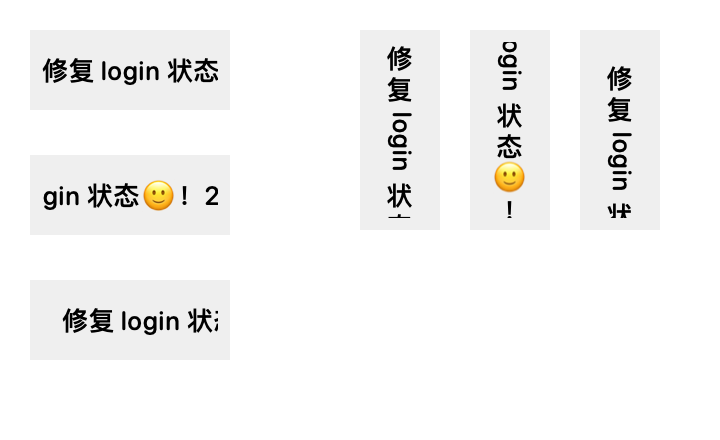

# 适中 HUD 与滚动标题验证记录

规格：[`docs/plan/2026-10-09-hud-medium-marquee.md`](../plan/2026-10-09-hud-medium-marquee.md)。日期：2026-10-10。

## 实现结果

- 设置与菜单提供标准、适中、精简三档，选择保存到本地；适中横向 244×40、竖向 40×244 点。
- 适中使用一个现有彩色菱形、100 点标题区和原状态灯；标题有效窗口为 88 点，图标设置只影响标准版。
- 长标题以 20 点/秒向左或向上滚动，完整文本副本间隔 24 点；短标题、无会话占位不滚动。
- 按会话保存本次运行的滚动进度；切走暂停、切回续播，横竖切换映射相对进度。
- 标题变更归零；仅状态变化、暂时退出轮播、隐藏和模式切换保留进度；删除记录时清理。
- 系统/屏幕休眠、减少动态效果暂停；减少动态效果下展示标题开头与省略标记，恢复后续播。
- 窗口代际令牌隔离新旧窗口，展示内容代际进一步隔离快速 A→B→A 中正在退场的旧 A；正式标题逐帧更新不触发 AppModel 整体发布。
- 控制器释放时退休对应令牌，停止活动计时；预览不获取正式展示令牌。

## 分阶段验证

| 阶段 | 验证 | 结果 |
| --- | --- | --- |
| 一：模式与几何 | 显示模式、偏好与菜单专项 | 25 项，0 失败 |
| 二：状态 | 注入时钟的会话独立进度、冻结、转换、边界、重命名与清理 | 5 项，0 失败 |
| 三：全文绘制 | 横竖绘制、循环边界逐像素比较、竖排解析及字符簇保留 | 10 项，0 失败 |
| 四：生命周期 | 续播、减少动态效果、休眠、旧令牌、旧视图冻结、模式及布局切换 | 滚动集成与绘制 5 项，0 失败 |
| 五：最终专项 | 滚动、四方向三档窗口、菜单、原窗口控制器回归 | 43 项，3 项实屏测试跳过，0 失败 |

最终 `swift build` 通过；`swift test` 共 305 项，7 项实屏测试因录屏权限跳过，0 失败，用时约 132 秒。`git diff --check` 通过。

## 固定进度样图检查



样图由真实 Core Text 标题绘制代码离屏生成，放大两倍便于检查。左侧从上到下为横向初始位置、移动 40 点、循环衔接前的位置；右侧从左到右为对应竖向位置。灰色块为 100 点标题区域，两端各 6 点留白，文字只在内部 88 点窗口显示。

已查看样图：中文保持直立、英文竖向旋转正确，表情和标点可见；文字移动局限在标题区域，循环下一轮头部能进入窗口。自动测试另验证一个完整周期前后输出像素完全相同、减少动态效果时不受偏移影响、短标题不会移动。

该图不是 WindowServer 实屏截图，不证明系统玻璃合成或屏幕切换过程中绝无残影。

可选重新导出：

```sh
TRACEFLOW_MARQUEE_ARTIFACT=/tmp/traceflow-marquee.png swift test --filter HUDMarqueeRenderingTests
```

## 关键数值验收

- A 周期长度 200，展示 2 秒后切 B：A 偏移 -40；切回 A 后再展示 1 秒：A 偏移 -60，后台时间不计入。
- 相对进度 0.4 从周期 200 映射到周期 300：偏移 -120，继续 1 秒后 -140。
- 文字长度 87、88 点静止，88.1 点触发滚动。
- 周期 200 在 9.99、10、10.01 秒处偏移分别为 -199.8、0、-0.2，副本接替保持画面连续。
- 相同标题、相同排版反复配置和激活不重置时钟；重复采样不重复累计时间。
- 真实窗口初次附着到屏幕可能触发 backingScaleFactor 重配置；集成断言容许不足 2 点的真实可见时间推进，纯状态及注入时钟测试仍使用严格数值比较。

## 已知验证限制

当前测试进程缺少屏幕录制权限。所有依赖 WindowServer 截图的测试按现有约定跳过，不能算作实屏通过。本次已完成实际窗口状态/几何与离屏绘制验证；系统玻璃背景合成、跨屏真实残影、实机休眠通知的视觉效果仍需有录屏权限的桌面环境验收。

休眠业务行为已用确定性通知处理入口测试，无需改变用户系统设置或实际让电脑休眠。
